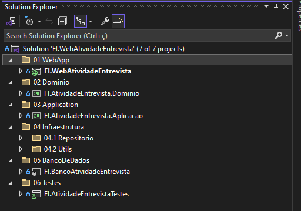
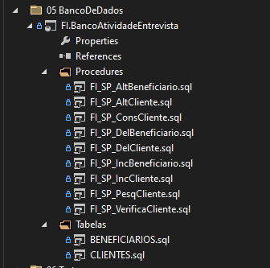
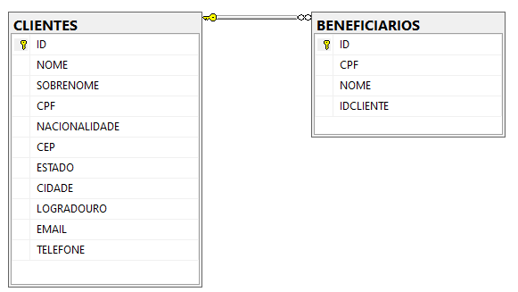
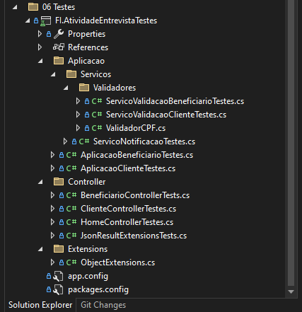

# FIAtividade

Projeto de Manutenção de Dados de Clientes
Este projeto foi ajustado utilizando as melhores práticas de Domain Driven Design (DDD) para diminuir o acoplamento e melhorar a manutenção do código. Abaixo estão as principais tecnologias e padrões de design implementados.

## Tecnologias Utilizadas

- **Microsoft Visual Studio Enterprise 2022**
- **C#**
- **ASP.NET MVC 5**
- **MSTest**
- **Moq**
- **Dapper**
- **SQL Server / SQL Server Management Studio**
- **FluentValidation**

## Padrões de Design

- **Inversion of Control (IoC)**: Implementado para a inversão de controle, permitindo a injeção de dependências e facilitando a substituição de componentes durante os testes e em tempo de execução.
- **Repository Pattern (com Dapper)**: Facilita a separação das responsabilidades de persistência dos dados, promovendo uma camada de abstração sobre as operações de banco de dados.
- **Domain Driven Design (DDD)**: Implementado para dividir a lógica do sistema em camadas bem definidas, como Domínio, Aplicação e Infraestrutura, melhorando a coesão e separação de responsabilidades.
- **Domain Notifications**: Utilizado para o tratamento de validações de negócios e notificações de erro, melhorando a comunicação entre as camadas e garantindo um fluxo consistente de informações.

## Justificativa das Escolhas de Tecnologias e Padrões

### Microsoft Visual Studio Enterprise 2022
- **Motivo**: IDE robusta que oferece uma vasta gama de ferramentas para desenvolvimento, teste e depuração, sendo ideal para projetos em C# e ASP.NET.

### C# e ASP.NET MVC 5
- **Motivo**: C# é uma linguagem moderna e versátil, enquanto o ASP.NET MVC 5 permite o desenvolvimento de aplicações web robustas, facilitando a separação de preocupações (Separation of Concerns) e promovendo um código mais limpo e fácil de manter.

### MSTest e Moq
- **Motivo**: Ferramentas essenciais para a escrita de testes unitários, garantindo a qualidade do código e permitindo a validação de funcionalidades de forma isolada. Moq é uma biblioteca de mocking que facilita a criação de mocks para testes.

### Dapper
- **Motivo**: Micro ORM que oferece alta performance e simplicidade nas operações de banco de dados, sendo ideal para projetos que necessitam de um mapeamento direto e rápido entre objetos e tabelas do banco de dados.

### SQL Server / SQL Server Management Studio
- **Motivo**: SQL Server é um banco de dados robusto e amplamente utilizado no mercado, oferecendo alta performance e ferramentas avançadas de gestão de dados. SQL Server Management Studio facilita a administração e execução de scripts SQL.

### FluentValidation
- **Motivo**: Biblioteca de validação que promove uma forma fluente e fácil de escrever regras de validação para os modelos, garantindo que os dados estejam sempre corretos antes de serem processados.

## Padrões de Design

### Inversion of Control (IoC)
- **Implementação**: Utilização de containers de injeção de dependência para gerenciar as dependências entre os componentes do sistema, promovendo um baixo acoplamento e alta testabilidade.

### Repository Pattern (com Dapper)
- **Implementação**: Criação de repositórios genéricos utilizando Dapper para abstrair as operações de banco de dados, permitindo que a lógica de persistência seja facilmente substituída ou modificada sem impactar outras partes do sistema.

### Domain Driven Design (DDD)
- **Implementação**: Divisão do sistema em camadas bem definidas:
  - **Domínio**: Contém as entidades, agregados e regras de negócio.
  - **Aplicação**: Contém os serviços de aplicação, que orquestram a lógica de negócio e interagem com os repositórios.
  - **Infraestrutura**: Contém a implementação dos repositórios e outras dependências externas.

### Domain Notifications
- **Implementação**: Utilização de um serviço de notificações para gerenciar e comunicar erros e validações de negócio, permitindo uma comunicação clara e consistente entre as camadas do sistema.

## Solução
   

- "01 WebApp" estão as telas da aplicação.
- "02 Dominio" possui as classes de domino do sistemas e abstrações para implementar as funcionalidades
- "03 Aplicacao" Faz o as validações e chamadas necessárias para orquestrar a lógica de negócio e a interação entre os diferentes componentes do sistema
- "04 Infraestrutura" Possui o Repository Pattern e bibliotecas de Cross Cutting
- "05 BancoDeDados" está o projeto de banco de dados.
   Com este projeto é possível ver facilmente ver as ultimas alterações, comparar os objetos do banco de dados, gerar scripts para alteração e caso necessário fazer updates
  
     
  
  
     
  
  
## Casos de Testes

   

### Executar os Casos de Teste

 - Abrir o Explorador de Testes
   No Visual Studio, vá para Testar > Janela > Explorador de Testes.
 
 - Compilar a Solução
	Certifique-se de que a solução está compilada. Clique em Compilar > Compilar Solução ou pressione Ctrl+Shift+B.
	
 - Executar os Testes
   No Explorador de Testes, você verá uma lista de todos os testes disponíveis.
   Clique em Executar Tudo para executar todos os testes ou selecione testes individuais e clique em Executar Selecionados.
